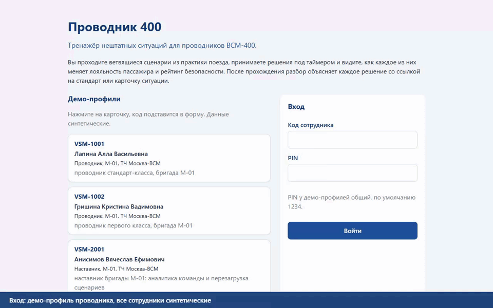

# Проводник 400

Тренажёр нештатных ситуаций для проводников ВСМ-400. Сотрудник проходит ветвящиеся сценарии по
карточкам «Ситуаций на борту» и стандартам СТО РЖД, принимает решения под серверным таймером и
видит последствия на двух шкалах: лояльности пассажира и безопасности. Разбор объясняет каждый
ход со ссылкой на норму. Результаты попадают в профиль, достижения, лидерборд и аналитику
компетенций; HR и LMS получают их через API. Сценарии хранятся в YAML и меняются без пересборки.

## Проверка демо для жюри

Скачайте репозиторий через **Code → Download ZIP** и распакуйте его или выполните:

```bash
git clone https://github.com/Arsenii7867/provodnik-400.git
cd provodnik-400
```

1. [Запустите приложение](#как-запустить): `start.cmd` на Windows или `./scripts/start.sh`
   на Linux/macOS. Для этого нужен Docker Desktop. Ручной запуск описан ниже.
2. Откройте `http://localhost:8000` и войдите: `VSM-1001` или `VSM-1002` (проводники),
   `VSM-2001` (наставник), PIN `1234`. Сотрудники и история синтетические.
3. В каталоге начните «Дым в тамбуре», пройдите до концовки и откройте разбор. Затем проверьте
   профиль, лидерборд и аналитику. [Маршрут по кликам](docs/user_flow.md#сценарий-демонстрации-по-кликам)
   включает лучшие решения и отдельный проход с истечением таймера.
4. Сопоставьте результат с [проверками конкретной ревизии](docs/verification.md) и
   [матрицей требований](docs/hackathon-compliance.md).

Прототип запускается локально; публичный сервер не развёрнут.

## Пять материалов для сдачи

| Поле формы | Материал |
|---|---|
| Код и история | [Репозиторий](https://github.com/Arsenii7867/provodnik-400), [коммиты](https://github.com/Arsenii7867/provodnik-400/commits/main/) |
| Рабочий прототип | [Запуск и демо-вход](#как-запустить) |
| Архитектура и диаграммы | [Компоненты, последовательность и данные](docs/architecture.md) |
| API, User Flow и игровые примеры | [API](docs/api.md), [OpenAPI](docs/openapi.json), [User Flow](docs/user_flow.md), [сценарии](docs/scenarios.md) |
| Ограничения и развитие | [План развития](docs/roadmap.md), [безопасность](docs/security.md) |

[Готовые тексты пяти полей](docs/submission.md) нужно перенести в раздел «Загрузка решения»
на платформе хакатона. Публикация репозитория не отправляет форму.

## Запись демонстрации



Запись создана проверкой `frontend/e2e/demo.spec.js` на базе из сида. Сначала «Дым в тамбуре»
проходится лучшим путём, затем таймер оставляют истечь. Сервер применяет ветку истечения.
[Видео в полном размере и без потери кадров](docs/media/demo.webm).

В интерфейсе есть каталог с фильтрами, цепочка ролевой модели, разбор по шагам с дельтами шкал
и цитатами норм, челленджи, уведомления о сгорающих баллах, рейтинг бригады, депо и компании,
радар компетенций и карта путей. Экраны описаны в [User Flow](docs/user_flow.md).

## Как запустить

### Docker: Windows, Linux и macOS

Установите Docker Desktop. На Windows дважды щёлкните `start.cmd` в корне проекта. Скрипт
сохраняет существующий `.env` или создаёт его из `.env.example`, при необходимости запускает
движок Docker Desktop, собирает frontend и backend и поднимает контейнер. После готовности
базы, сценариев и интерфейса открывается `http://localhost:8000`.

Первый запуск занимает больше времени: Docker скачивает базовые образы. Для остановки
используйте `stop.cmd`. SQLite остаётся в именованном томе и доступна при следующем запуске.

Если порт 8000 занят, добавьте в `.env` строку `APP_PORT=8011` и снова запустите `start.cmd`.
PowerShell без открытия браузера:

```powershell
.\scripts\start.ps1 -NoBrowser
```

Linux и macOS, при работающем движке Docker:

```bash
./scripts/start.sh
./scripts/stop.sh
```

Статус: `docker compose ps`. Журнал: `docker compose logs --tail=100 app`.
`GET /api/health` проверяет живость процесса; `GET /api/health/ready` возвращает 200, когда
доступны база, валидный контент и собранный интерфейс. Swagger: `http://localhost:8000/docs`.
Пустая демо-база заполняется автоматически; повторный запуск сида не меняет существующую.

### Без Docker: Python 3.13 и Node 24 LTS

Команды выполняются из корня репозитория. Сначала соберите frontend:

```
cd frontend
npm ci
npm run build
cd ..
```

Если `.env` отсутствует, скопируйте его из `.env.example`. Существующий файл оставьте.
Сервер раздаёт API и frontend с одного порта. Параметр `--env-file ../.env` загружает настройки;
`AUTO_SEED=1` заполняет пустую базу.

Windows (PowerShell):

```powershell
if (!(Test-Path .env)) { Copy-Item .env.example .env }
cd backend
python -m venv .venv
.venv\Scripts\activate
pip install -r requirements.txt
uvicorn app.main:app --env-file ../.env --host 127.0.0.1 --port 8000 --no-proxy-headers
```

Linux и macOS:

```bash
[ -f .env ] || cp .env.example .env
cd backend
python3 -m venv .venv
source .venv/bin/activate
pip install -r requirements.txt
uvicorn app.main:app --env-file ../.env --host 127.0.0.1 --port 8000 --no-proxy-headers
```

Сервер занимает терминал; для следующих команд откройте второй. Ручной вызов
`python -m app.seed` читает окружение процесса и не загружает `.env`; при обычном запуске он
не нужен. Флаг `--no-proxy-headers` запрещает uvicorn доверять `X-Forwarded-For`; его убирают
только за доверенным обратным прокси. Настройки описаны в `.env.example`.

Для разработки frontend команда `npm run dev` запускает Vite на `http://localhost:5173`
с проксированием `/api` на сервер.

## Проверки

Тесты и линтер устанавливаются отдельно. Из папки `backend`:

```
pip install -r requirements-dev.txt
python -m pytest -q
python -m ruff check .
python -m app.scenarios.validator ../content
```

Из папки `frontend` выполните `npm test` для тестов таймера и графиков. Для сквозных проверок
установите браузер командой `npx playwright install chromium`; на Linux системные зависимости
ставит `npx playwright install --with-deps chromium`. Затем выполните `npm run build` и
`npx playwright test`: тесты сами запускают сервер с собранным frontend на порту 8010.

После установки зависимостей сервера, frontend и браузера все проверки запускаются из корня:
`bash scripts/check.sh`. На Windows нужен Git Bash. Workflow `.github/workflows/check.yml`
выполняет этот скрипт и аудит npm; [расширенные проверки](docs/extended-checks.md) охватывают
другие браузеры, PostgreSQL и ограниченную нагрузку. Результат конкретной ревизии смотрите
во вкладке Actions и [сводке CI](docs/verification.md).

## Структура репозитория

| Путь | Содержимое |
|---|---|
| `backend/app` | FastAPI: настройки, база, вход по коду и PIN, формат ошибок |
| `backend/app/api` | авторизация, профиль, сценарии, прохождение, разбор, достижения, лидерборд, уведомления, челленджи, аналитика, интеграция, администрирование |
| `backend/app/scenarios` | движок, загрузчик, валидатор, перебор путей, граф, перечитывание контента |
| `backend/app/services` | прохождение с таймерами, результаты, XP, уровни, достижения, челленджи, уведомления, события LMS, рейтинг и аналитика |
| `backend/tests` | pytest с временной SQLite; ошибочные сценарии в `tests/fixtures/broken` |
| `content` | YAML-справочники и сценарии; [формат](docs/scenarios.md) |
| `frontend/src` | React; обращения к серверу через `src/lib/api.js` |
| `frontend/e2e` | Playwright |
| `docs` | архитектура, API и `openapi.json`, User Flow, сценарии, безопасность, план развития |
| `Dockerfile`, `compose.yaml` | сборка и локальный запуск с постоянной базой |
| `start.cmd`, `stop.cmd`, `scripts/start.*` | запуск, ожидание готовности, открытие браузера и остановка с сохранением данных |
| `scripts/check.sh` | запуск всех проверок |

## Добавление сценария

1. Создайте `content/scenarios/<id>.yaml` по образцу `content/scenarios/smoking_vestibule.yaml`:
   шапка, контекст, стартовые шкалы, узлы с вариантами, таймер и ветка истечения, разбор со
   ссылками на `content/refs.yaml`.
2. Из папки `backend` выполните `python -m app.scenarios.validator ../content`.
   В строке `ИТОГ` должно быть `ошибок=0`.
3. Сервер перечитает файл без перезапуска. Для уведомления сотрудников о новом сценарии
   наставник вызывает `POST /api/admin/scenarios/reload`.

Формат и упражнения с изменением контента описаны в [docs/scenarios.md](docs/scenarios.md).
[Аудит готовности](docs/launch-readiness.md) содержит чек-лист демонстрации и задачи перед
промышленным запуском. [Аудит от 26.09.2026](docs/audit-2026-09-26.md) сохранён как исторический
снимок; [ревью от 27.09.2026](docs/audit-2026-09-27.md) сопоставляет PDF с реализацией, уточняет
назначение тренажёра и описывает исправления надёжности.
