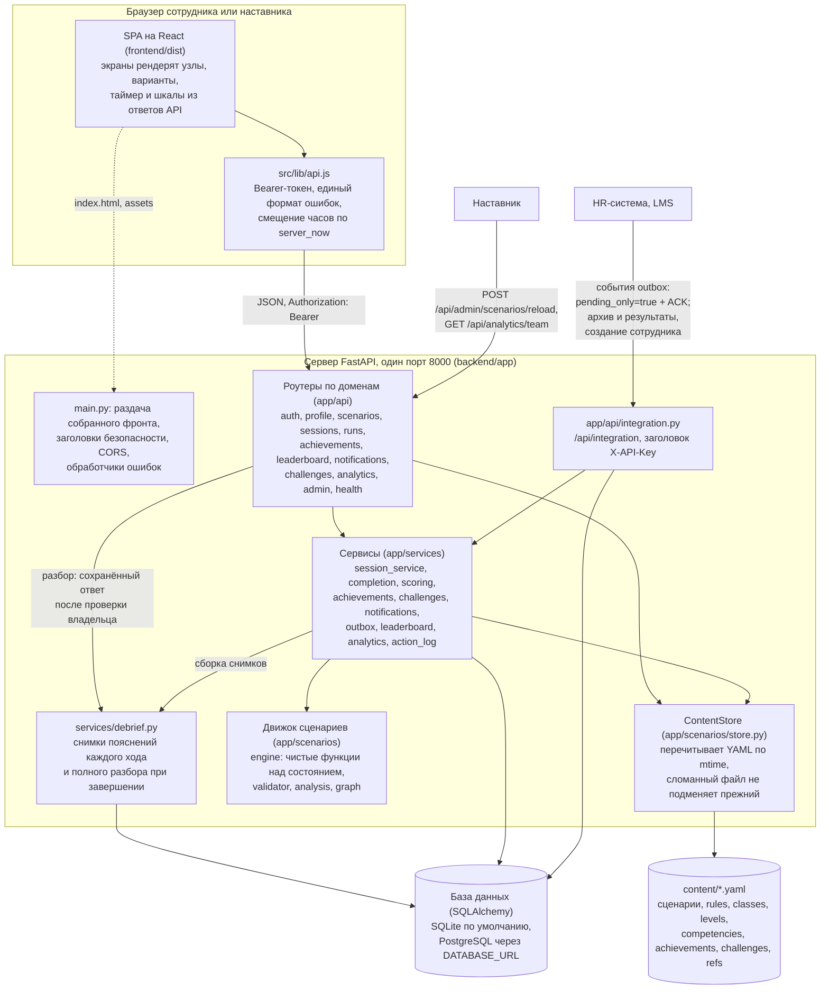
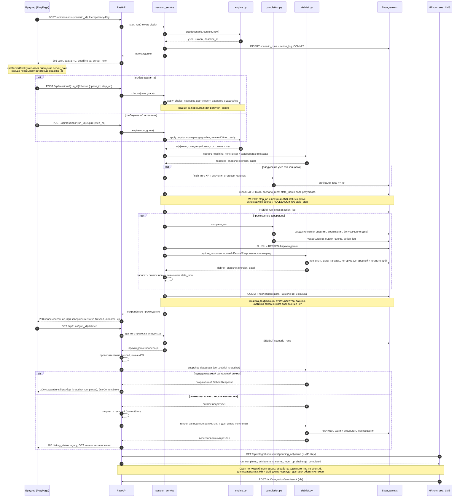
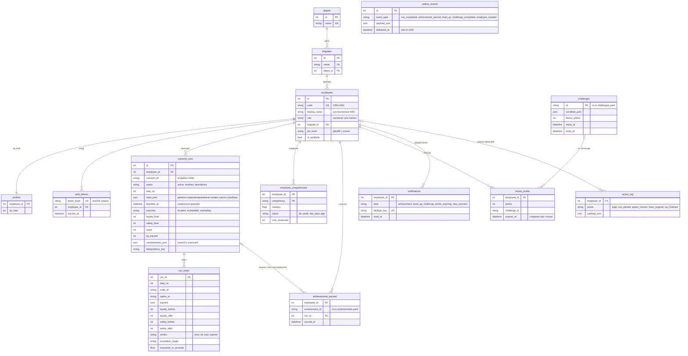

# Архитектура

«Проводник 400» запускается одним процессом FastAPI и отдаёт JSON-API и собранный React-фронт
на одном порту. Сценарии, справочники и правила подсчёта хранятся в YAML в `content/`, данные
сотрудников, прогресс и снимки разбора в базе. Движок состоит из чистых функций над словарём
состояния. Ниже показаны три диаграммы: компоненты, прохождение с таймером и данные, затем
описаны решения и способы расширения. Исходники находятся в `docs/diagrams/*.mmd`, изображения
в `docs/img/*.svg`. Mermaid-блоки под изображениями повторяют исходники и раскрываются по нажатию.
Диаграмма данных показывает ключевые колонки; полный список находится в моделях.

На диаграммах показана непрерывная доставка через `pending_only=true` без курсора с ACK
после идемпотентной обработки. Для чтения архива остаётся режим с `after_id`:
его ограничения и гарантии доставки описаны в разделе «Решения и причины» ниже.

## Компоненты

Исходник Mermaid

Назначение блоков:

| Блок | Где | Роль |
|---|---|---|
| SPA | `frontend/src` | экраны входа, дашборда, каталога, прохождения, разбора, профиля, лидерборда, аналитики и карты сценария; сценариев в бандле нет, всё приходит из API; `src/lib/api.js` единственная точка обращения к серверу, `src/lib/timer.js` считает остаток таймера по смещению часов сервера |
| main.py | `backend/app/main.py` | сборка приложения: настройки из окружения, база, ContentStore, CORS, единый формат ошибок, заголовки безопасности и предел тела запроса, роутеры, раздача `frontend/dist` с фолбэком на `index.html` для маршрутов React |
| Роутеры | `backend/app/api` | по одному модулю на домен, теги OpenAPI по-русски, у каждой операции summary; тела запросов и формы ответов в `backend/app/schemas.py` |
| Сервисы | `backend/app/services` | прохождение с серверными дедлайнами и условным обновлением шага, итог прохождения и всё, что он запускает, подсчёт XP и уровней, достижения и челленджи по правилам YAML, уведомления с дедупликацией, исходящие события, рейтинг, аналитика личная и по бригаде, журнал действий |
| Движок | `backend/app/scenarios` | `engine.py` без БД и без веб-фреймворка: старт, доступные варианты, эффекты, выбор, ветка истечения, отложенные последствия, исход; `validator.py` и `checks.py` проверяют файлы, `analysis.py` перебирает пути, `graph.py` строит граф и Mermaid для карты сценария |
| ContentStore | `backend/app/scenarios/store.py` | контент в памяти процесса; при каждом обращении сравнивает mtime и размер файлов и перечитывает изменённые через валидатор; при ошибке в любом файле сервер использует прежнюю проверенную версию целиком, ошибки видны в `GET /api/health` (поле `content_errors`) и в отчёте наставника |
| Контент | `content/` | сценарии `scenarios/<id>.yaml` и справочники: компетенции, классы обслуживания, уровни, правила подсчёта, ссылки на нормы, достижения, челленджи; формат в `docs/scenarios.md` |
| База | `backend/app/db.py`, `models.py` | SQLAlchemy 2 с Mapped-моделями; SQLite с WAL и busy_timeout по умолчанию, PostgreSQL по `DATABASE_URL` тем же кодом |
| Интеграция | `backend/app/api/integration.py` | HR и LMS обращаются с заголовком `X-API-Key`: результаты сотрудника, архив прохождений и событий с курсором, неподтверждённые события с ACK для одного логического получателя, журнал действий, справочник компетенций, создание сотрудника |

## Прохождение с таймером

Исходник Mermaid

Ключевые места этой последовательности в коде:

1. Дедлайн хранится как момент времени, а не остаток (`engine.enter_node`): он переживает
   перезапуск сервера и не зависит от часов клиента. Клиент получает `deadline_at` и `server_now`,
   считает смещение своих часов и рисует кольцо таймера; при нуле он вызывает `expire`.
2. Выбор, пришедший после `deadline_at` плюс допуск `TIMER_GRACE_SECONDS`, сервер не отклоняет, а
   применяет ветку истечения и отвечает `expired: true` (`engine.apply_choice`). Истечение, о
   котором клиент сообщил раньше срока минус допуск, отклоняется с `409 too_early`. Допуск
   двусторонний, поэтому больше пяти секунд сервер не принимает.
3. Каждый ход записывается условным UPDATE по номеру шага (`session_service.commit_step`): двойной клик,
   устаревшая вкладка или гонка «истечение против выбора» дают `409 stale_step`, а не второй ход.
   Ход, его снимок в `run_steps`, запись в журнал действий и итог прохождения фиксируются одной
   транзакцией.
4. На входе в концовку `completion.finish_run` считает исход по порогам из `content/rules.yaml`
   (сценарий может поднять их полем `outcome_rules`) и раскладку XP, а `completion.complete_run`
   в той же транзакции пересчитывает владение компетенциями по окну прохождений, выдаёт
   достижения по декларативным правилам, начисляет бонусы выполненных челленджей со сроком
   сгорания, создаёт уведомление о новом уровне и события для LMS.
5. Повтор `POST /api/sessions` с тем же `Idempotency-Key` возвращает то же прохождение (200
   вместо 201), поэтому двойная отправка формы не открывает второе.

## Данные

Исходник Mermaid

Диаграмма показывает ключевые колонки; полный список находится в `backend/app/models.py`.

- В `scenario_runs.state_json` лежит состояние движка целиком (узел, шкалы, флаги, выбранные
  варианты, цепочка ролевой модели, очередь отложенных последствий, очки компетенций, история
  шагов). Сервис читает его, отдаёт движку и записывает обратно условным UPDATE.
- `run_steps` хранит снимок текста узла и варианта на момент хода. В `state_json` дополнительно
  сохраняются объяснения, реплика пассажира, лучший вариант и развёрнутые нормы каждого нового
  хода; при завершении сохраняется полный ответ разбора, включая уровни, компетенции и награды.
  Формат снимков версии 1 не требует изменения таблиц. Старые записи явно помечаются
  `legacy`, а итог со старыми шагами без снимков имеет статус `partial`.
- Все столбцы времени используют `UtcDateTime`: в базу уходит naive UTC, наружу приходит aware
  UTC, поэтому сравнения с часами сервера ведут себя одинаково в SQLite и PostgreSQL.
- Уникальные ключи обеспечивают ограничения на уровне БД: одно достижение на сотрудника
  (`employee_id, achievement_id`), один бонус на челлендж, одно уведомление на повод
  (`dedupe_key`), один ход на номер шага (`run_id, step_no`), одно прохождение на ключ
  идемпотентности.
- Срок бонусов хранится в `bonus_points.expires_at`: рейтинг суммирует только неистёкшие бонусы, а
  уведомление о сгорании создаётся при чтении профиля, уведомлений или челленджей, когда до срока
  меньше `bonus.expiring_notice_hours` из `content/rules.yaml`. Фоновых задач нет.

## Решения и причины

Исторический разбор сохраняет обратную связь из контента, по которому рассчитан ход.
Правки активного сценария не меняют этот снимок. Полный итог фиксируется после
вычисления результата и наград в той же транзакции; ошибка сохранения откатывает её целиком.
`services/debrief.py` формирует ответ, API проверяет владельца и завершённость. Для
поддерживаемого итогового снимка GET не обращается к YAML. Для `legacy` он собирает доступные
данные без записи в БД, в том числе после удаления сценария. Недостающие исторические
тексты достоверно восстановить нельзя. Неизвестная версия снимка не считается поддерживаемой.
Активные попытки продолжают видеть правки контента; вся версия сценария при старте не закрепляется.
Подробности: [исторический разбор](historical-debrief.md).

Доставка HR/LMS через outbox использует `GET /api/integration/events?pending_only=true`:
выбираются все неподтверждённые события по id без продвижения курсора. Это at-least-once для
одного логического получателя: внешний обработчик сохраняет результат идемпотентно по id и
затем вызывает ack. События могут приходить повторно; поздняя фиксация транзакции с меньшим id
не приводит к потере события.
`next_after_id` в этом режиме всегда 0. Общий `delivered_at` не поддерживает независимые
подтверждения HR и LMS; их доставка требует одного диспетчера. API с курсором служит
для просмотра архива и не гарантирует непрерывную доставку при параллельных завершениях.
Изменений схемы БД для этого режима не требуется.

Развилка добавляется правкой YAML и проверяется валидатором. ContentStore сравнивает mtime
файлов при каждом обращении, поэтому изменение доступно без перезапуска. Версии сценариев
хранятся в git вместе с кодом; ссылки на нормы и цитаты заданы в `content/refs.yaml`. При ошибке
в файле сервер использует прежнюю проверенную версию и сообщает имя файла и строку.

Таймеры используют время сервера. Клиент показывает остаток: дедлайн записан в
момент входа в узел, поздний выбор трактуется как истечение, раннее истечение отклоняется.
Время клиента не определяет исход. Тесты проверяют истечение без ожидания, сдвигая
единые часы приложения `app/clock.py`.

Пороги исходов, формула XP, окно владения, сроки сгорания, пределы DSL,
чувствительность классов, правила достижений и условия челленджей читаются из `content/`. В
движке и сервисах констант шкал нет, поэтому правило меняется за минуту в одном файле, а валидатор
проверяет, что новое число не ломает сценарии.

SQLite по умолчанию, PostgreSQL по `DATABASE_URL`. Для демо и локального запуска достаточно
файла в `backend/data` с WAL и `busy_timeout`; PostgreSQL подключается через psycopg.
В PostgreSQL старты одного сотрудника сериализуются блокировкой `FOR NO KEY UPDATE` до
проверки ключа идемпотентности и закрытия прежнего прохождения. SQLite не применяет эту
строковую блокировку; запись сериализует сама база. Условный UPDATE по номеру шага защищает
ход и начисление результата от повторной обработки.
PostgreSQL 17 проверен API-тестами, Chromium E2E и нагрузкой на 10/25 пользователей в одном
процессе приложения. [Результаты](verification.md) привязаны к ревизии кода;
[методика](extended-checks.md) описывает воспроизведение и ограничения.

FastAPI раздаёт `frontend/dist` рядом с API в одном процессе. CORS нужен для `npm run dev`.
Страница приложения идёт с CSP
`default-src 'self'`, Swagger UI и ReDoc отдаются с файлов сервера (`fastapi-offline`), шрифтов
и скриптов с внешних адресов нет: контур заказчика может быть закрытым.

Без LLM внутри продукта. Каждое решение, оценка и разбор детерминированы и объяснимы: вердикт,
причина и ссылка на норму заданы в файле сценария, а не генерируются в момент ответа.
Сид с фиксированным зерном проходит сценарии тем же движком, поэтому тесты воспроизводимы.

В демо работает один процесс uvicorn. Он хранит лимит попыток входа в памяти; LMS читает
события из таблицы через pending/ACK, без фоновой доставки. Срок бонусов проверяется при чтении.
Условия перехода на несколько процессов описаны ниже.

Локальный запуск через [Dockerfile](../Dockerfile) и [Compose](../compose.yaml) сохраняет ту же
архитектуру: один контейнер с одним процессом uvicorn раздаёт API и собранный frontend.
SQLite находится в именованном томе `provodnik-data`, контент подключён из папки `content/`
на хосте только для чтения. Порт публикуется на `127.0.0.1`; скрипты запуска ждут
`GET /api/health/ready`, который проверяет связь с базой, валидный контент, подключённый SPA
и наличие локальных JS/CSS, указанных в HTML. Ручной запуск без Docker остаётся доступен
по [README](../README.md). Профиль предназначен для локального запуска; несколько экземпляров и промышленная
инфраструктура им не проверяются.

## Как расширять и масштабировать

Новый сценарий добавляется одним файлом `content/scenarios/<id>.yaml`: валидатор проверяет форму, граф,
пути и разбор, `POST /api/admin/scenarios/reload` перечитывает папку и рассылает уведомление
«новый сценарий», а каталог, карта, аналитика и рекомендации подхватывают его по данным. Новое
достижение добавляется записью в `content/achievements.yaml` с типом правила из реестра `RULES` в
`backend/app/services/achievements.py`; новый тип правила требует одной функции над фактами
прохождения и строки в реестре. Челлендж, класс обслуживания, уровень и компетенция добавляются
тем же способом в своих справочниках. Ядро (движок, сервисы, роутеры) при этом не правится.

Аналитика пересчитывается при каждом чтении по истории сотрудника; при тысячах прохождений на человека её стоит кэшировать по последнему
`run_id`. Перебор путей сценария ограничен `analysis.path_limit` в `content/rules.yaml` и
выполняется один раз при чтении файла, результат живёт в памяти до следующей правки. При
переходе на несколько процессов uvicorn за PostgreSQL сервер остаётся без состояния, кроме двух
вещей: лимит входа станет отдельным на каждый процесс (нужно общее хранилище счётчиков), а папка
`content/` должна быть одной на всех (общий том), иначе процессы разойдутся в версиях сценариев.
Уникальные ключи, блокировка старта в PostgreSQL и условный UPDATE по шагу защищают
соответствующие операции от конкурентных запросов. Они не заменяют проверку приложения
с несколькими воркерами: горизонтальное масштабирование и длительная нагрузка не испытаны.

## Проверки

Из папки `backend`: `pytest` (движок, валидатор, API через TestClient на временной SQLite, живое
изменение, сид без персональных данных, согласованность документации), `ruff check`, валидатор
контента `python -m app.scenarios.validator ../content`. Из папки `frontend`: `npm test`
(логика таймера и геометрия графиков через `node --test`), `npm run build`, `npx playwright test`
(сквозные проверки в браузере: вход, прохождение с реальным истечением таймера, разбор, XP,
уведомление, лидерборд, аналитика, карта). Всё вместе запускает `scripts/check.sh`.

Firefox, WebKit, мобильная эмуляция, PostgreSQL и нагрузка запускаются по
[отдельной инструкции](extended-checks.md). [Сводка результатов](verification.md) указывает
конкретную ревизию, успешные CI-запуски и ожидаемые пропуски.
