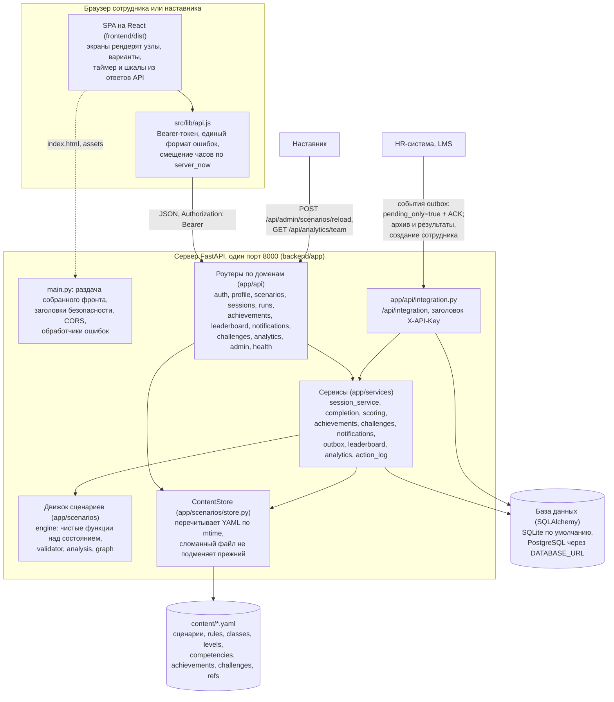
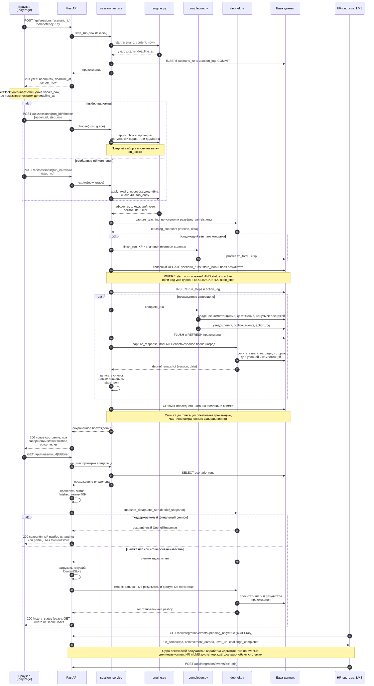
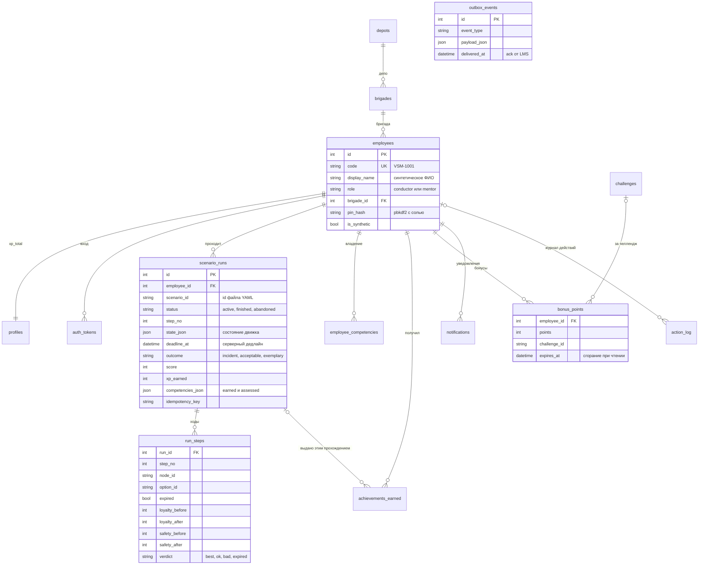

# Архитектура

«Проводник 400» это один процесс FastAPI, который на одном порту отдаёт JSON-API и собранный
фронт на React. Сценарии, справочники и правила подсчёта лежат в YAML в папке `content/`, база
хранит только людей и прогресс, а движок сценариев это набор чистых функций над словарём
состояния. Ниже три диаграммы (компоненты, последовательность прохождения с таймером, данные),
решения с причинами и то, как продукт расширяется без правки ядра. Исходники диаграмм лежат в
`docs/diagrams/*.mmd`, картинки в `docs/img/*.svg`; Mermaid-блоки ниже доступны для тех, у кого
просмотрщик умеет их рисовать. Компоненты и последовательность повторяют исходники, а блок
данных сокращён до ключевых таблиц и колонок.

На диаграммах показана непрерывная доставка через `pending_only=true` без курсора с ACK
после идемпотентной обработки. Режим чтения архива с `after_id` остаётся отдельным:
его ограничения и гарантии доставки описаны в разделе «Решения и причины» ниже.

## Компоненты





Что делает каждый блок:

| Блок | Где | Роль |
|---|---|---|
| SPA | `frontend/src` | экраны входа, дашборда, каталога, прохождения, разбора, профиля, лидерборда, аналитики и карты сценария; сценариев в бандле нет, всё приходит из API; `src/lib/api.js` единственная точка обращения к серверу, `src/lib/timer.js` считает остаток таймера по смещению часов сервера |
| main.py | `backend/app/main.py` | сборка приложения: настройки из окружения, база, ContentStore, CORS, единый формат ошибок, заголовки безопасности и предел тела запроса, роутеры, раздача `frontend/dist` с фолбэком на `index.html` для маршрутов React |
| Роутеры | `backend/app/api` | по одному модулю на домен, теги OpenAPI по-русски, у каждой операции summary; тела запросов и формы ответов в `backend/app/schemas.py` |
| Сервисы | `backend/app/services` | прохождение с серверными дедлайнами и условным обновлением шага, итог прохождения и всё, что он запускает, подсчёт XP и уровней, достижения и челленджи по правилам YAML, уведомления с дедупликацией, исходящие события, рейтинг, аналитика личная и по бригаде, журнал действий |
| Движок | `backend/app/scenarios` | `engine.py` без БД и без веб-фреймворка: старт, доступные варианты, эффекты, выбор, ветка истечения, отложенные последствия, исход; `validator.py` и `checks.py` проверяют файлы, `analysis.py` перебирает пути, `graph.py` строит граф и Mermaid для карты сценария |
| ContentStore | `backend/app/scenarios/store.py` | контент в памяти процесса; при каждом обращении сравнивает mtime и размер файлов и перечитывает изменённые через валидатор; при ошибке в любом файле сервер живёт на прежней проверенной версии целиком, ошибки видны в `GET /api/health` (поле `content_errors`) и в отчёте наставника |
| Контент | `content/` | сценарии `scenarios/<id>.yaml` и справочники: компетенции, классы обслуживания, уровни, правила подсчёта, ссылки на нормы, достижения, челленджи; формат в `docs/scenarios.md` |
| База | `backend/app/db.py`, `models.py` | SQLAlchemy 2 с Mapped-моделями; SQLite с WAL и busy_timeout по умолчанию, PostgreSQL по `DATABASE_URL` тем же кодом |
| Интеграция | `backend/app/api/integration.py` | HR и LMS ходят с заголовком `X-API-Key`: результаты сотрудника, архив прохождений и событий с курсором, неподтверждённые события с ACK для одного логического получателя, журнал действий, справочник компетенций, создание сотрудника |

## Прохождение с таймером



```mermaid
sequenceDiagram
  autonumber
  participant B as Браузер (PlayPage, useServerClock)
  participant A as FastAPI (app/api/sessions.py)
  participant S as session_service
  participant E as engine.py
  participant C as completion.py
  participant D as База данных
  participant H as HR-система, LMS

  B->>A: POST /api/sessions {scenario_id}, заголовок Idempotency-Key
  A->>S: start_run(now из clock)
  S->>E: start(scenario, content, now)
  E-->>S: состояние: узел, шкалы, deadline_at = now + timer.seconds
  S->>D: INSERT scenario_runs (state_json, deadline_at), action_log
  A-->>B: 201 узел, варианты, deadline_at, server_now
  Note over B: offset = server_now минус Date.now(), кольцо таймера считает остаток до deadline_at

  alt выбор до дедлайна
    B->>A: POST /api/sessions/{run_id}/choose {option_id, step_no}
    A->>S: choose(now, grace)
    S->>E: apply_choice: вариант доступен в узле, now <= deadline_at + grace
    E-->>S: эффекты на обе шкалы, флаги, отложенные последствия, следующий узел
  else остаток дошёл до нуля (или выбор пришёл после дедлайна)
    B->>A: POST /api/sessions/{run_id}/expire {step_no}
    A->>S: expire(now, grace)
    S->>E: apply_expiry: now >= deadline_at минус grace, иначе 409 too_early
    E-->>S: ветка on_expire: свои эффекты и узел, куда иначе не попасть
  end

  S->>D: UPDATE scenario_runs WHERE step_no = прежний (иначе 409 stale_step), INSERT run_steps
  A-->>B: 200 новое состояние, expired: true при истечении

  opt следующий узел это концовка
    S->>C: finish_run: исход по порогам, XP по rules.yaml
    C->>D: profiles.xp_total += xp
    S->>D: условный UPDATE с исходом, шкалами, score, xp
    S->>C: complete_run
    C->>D: employee_competencies (владение по окну прохождений)
    C->>D: achievements_earned по правилам achievements.yaml, notifications, outbox_events
    C->>D: bonus_points за выполненный челлендж (expires_at), уведомление level_up
    A-->>B: 200 status finished, outcome, xp
    B->>A: GET /api/runs/{run_id}/debrief
    A-->>B: разбор по шагам с цитатами норм, новые достижения, дельты компетенций
  end

  H->>A: GET /api/integration/events?pending_only=true (X-API-Key)
  A-->>H: run_completed, achievement_earned, level_up, challenge_completed
  Note over A,H: Один логический получатель: идемпотентная обработка по event.id;<br/>при независимых HR и LMS диспетчер подтверждает после доставки обеим системам
  H->>A: POST /api/integration/events/ack {ids}
```

Ключевые места этой последовательности в коде:

1. Дедлайн хранится моментом времени, а не остатком (`engine.enter_node`): он переживает
   перезапуск сервера и не зависит от часов клиента. Клиент получает `deadline_at` и `server_now`,
   считает смещение своих часов и рисует кольцо таймера; при нуле он вызывает `expire`.
2. Выбор, пришедший после `deadline_at` плюс допуск `TIMER_GRACE_SECONDS`, сервер не отклоняет, а
   применяет ветку истечения и отвечает `expired: true` (`engine.apply_choice`). Истечение, о
   котором клиент сообщил раньше срока минус допуск, отклоняется с `409 too_early`. Допуск
   двусторонний, поэтому больше пяти секунд сервер не принимает.
3. Каждый ход это условный UPDATE по номеру шага (`session_service.commit_step`): двойной клик,
   устаревшая вкладка или гонка «истечение против выбора» дают `409 stale_step`, а не второй ход.
   Ход, его снимок в `run_steps`, запись в журнал действий и итог прохождения фиксируются одной
   транзакцией.
4. На входе в концовку `completion.finish_run` считает исход по порогам из `content/rules.yaml`
   (сценарий может поднять их полем `outcome_rules`) и раскладку XP, а `completion.complete_run`
   в той же транзакции пересчитывает владение компетенциями по окну прохождений, выдаёт
   достижения по декларативным правилам, начисляет бонусы выполненных челленджей со сроком
   сгорания, создаёт уведомление о новом уровне и события для LMS.
5. Повтор `POST /api/sessions` с тем же `Idempotency-Key` возвращает то же прохождение (200
   вместо 201), поэтому двойная отправка формы не открывает второе.

## Данные





На диаграмме ключевые колонки, полный список в `backend/app/models.py`. Что важно знать о
данных:

- В `scenario_runs.state_json` лежит состояние движка целиком (узел, шкалы, флаги, выбранные
  варианты, цепочка ролевой модели, очередь отложенных последствий, очки компетенций, история
  шагов). Сервис читает его, отдаёт движку и записывает обратно условным UPDATE.
- `run_steps` хранит снимок текста узла и варианта на момент хода: разбор показывает то, что
  сотрудник видел, даже если файл сценария потом поправили; тексты «почему» и «как лучше» и
  цитаты норм берутся из текущего файла.
- Все столбцы времени идут через `UtcDateTime`: в базу уходит naive UTC, наружу приходит aware
  UTC, поэтому сравнения с часами сервера ведут себя одинаково в SQLite и PostgreSQL.
- Уникальные ключи держат инварианты без кода: одно достижение на сотрудника
  (`employee_id, achievement_id`), один бонус на челлендж, одно уведомление на повод
  (`dedupe_key`), один ход на номер шага (`run_id, step_no`), одно прохождение на ключ
  идемпотентности.
- Сгорающие баллы это `bonus_points.expires_at`: рейтинг суммирует только неистёкшие бонусы, а
  уведомление о сгорании создаётся при чтении профиля, уведомлений или челленджей, когда до срока
  меньше `bonus.expiring_notice_hours` из `content/rules.yaml`. Фоновых задач нет.

## Решения и причины

Доставка HR/LMS через outbox использует `GET /api/integration/events?pending_only=true`:
выбираются все неподтверждённые события по id без продвижения курсора. Это at-least-once для
одного логического получателя: внешний обработчик сохраняет результат идемпотентно по id и
затем вызывает ack. Повторные доставки допустимы, а поздний commit с меньшим id не теряется.
`next_after_id` в этом режиме всегда 0. Общий `delivered_at` не поддерживает независимые
подтверждения HR и LMS; их доставка требует одного диспетчера. Прежние cursor API остаются
для просмотра архива, не дают гарантии непрерывного потока при параллельных завершениях.
Изменений схемы БД для этого режима не требуется.

Сценарии в файлах, а не в базе. Развилка добавляется текстовой правкой YAML, проверяется
валидатором и видна в работающем сервере без перезапуска, потому что ContentStore сравнивает
mtime файлов при каждом обращении. История сценариев живёт в git вместе с кодом, а разбор
ссылается на нормы через `content/refs.yaml` с цитатами. База хранит только прогресс, поэтому
сломанный файл не может испортить историю прохождений: сервер продолжает работать на прежней
версии и показывает ошибку с именем файла и строкой.

Таймеры на сервере. Клиент только показывает остаток, а решает время сервера: дедлайн записан в
момент входа в узел, поздний выбор трактуется как истечение, раннее истечение отклоняется.
Так исход не зависит ни от часов, ни от честности клиента, а тесты проверяют истечение без
ожидания, сдвигая единственные часы приложения `app/clock.py`.

Числа только в YAML. Пороги исходов, формула XP, окно владения, сроки сгорания, пределы DSL,
чувствительность классов, правила достижений и условия челленджей читаются из `content/`. В
движке и сервисах констант шкал нет, поэтому правило меняется за минуту в одном файле, а валидатор
проверяет, что новое число не ломает сценарии.

SQLite по умолчанию, PostgreSQL по `DATABASE_URL`. Для демо и локального запуска достаточно
файла в `backend/data` с WAL и `busy_timeout`; PostgreSQL подключается через psycopg.
В PostgreSQL старты одного сотрудника сериализуются блокировкой `FOR NO KEY UPDATE` до
проверки ключа идемпотентности и закрытия прежнего прохождения. SQLite не применяет эту
строковую блокировку; запись сериализует сама база. Условный UPDATE по номеру шага защищает
ход и начисление результата от повторной обработки.
PostgreSQL 17 проверен API-тестами, Chromium E2E и нагрузкой на 10/25 пользователей в одном
процессе приложения. [Результаты](verification.md) привязаны к ревизии кода;
[методика](extended-checks.md) описывает воспроизведение и ограничения.

Один порт и ничего внешнего. FastAPI раздаёт `frontend/dist` рядом с API, поэтому для запуска
нужен один процесс, а CORS нужен только для `npm run dev`. Страница приложения идёт с CSP
`default-src 'self'`, Swagger UI и ReDoc отдаются с файлов сервера (`fastapi-offline`), шрифтов
и скриптов с внешних адресов нет: контур заказчика может быть закрытым.

Без LLM внутри продукта. Каждое решение, оценка и разбор детерминированы и объяснимы: вердикт,
причина и ссылка на норму заданы в файле сценария, а не генерируются в момент ответа.
Это делает тесты воспроизводимыми (сид с фиксированным зерном проходит сценарии тем же
движком), а живое изменение честным: правка файла меняет поведение ровно там, где её сделали.

Один процесс на демо. Лимит попыток входа считается в памяти процесса, исходящие события лежат в
таблице и забираются LMS через pending/ACK без фоновой доставки, бонусы сгорают при чтении. Это
осознанный выбор для одного uvicorn; что меняется при нескольких процессах, описано ниже.

Локальный запуск через [Dockerfile](../Dockerfile) и [Compose](../compose.yaml) сохраняет ту же
архитектуру: один контейнер с одним процессом uvicorn раздаёт API и собранный frontend.
SQLite находится в именованном томе `provodnik-data`, контент подключён из папки `content/`
на хосте только для чтения. Порт публикуется на `127.0.0.1`; скрипты запуска ждут
`GET /api/health/ready`, который проверяет связь с базой, валидный контент, подключённый SPA
и наличие локальных JS/CSS, указанных в HTML. Ручной запуск без Docker остаётся доступен
по [README](../README.md). Это локальный профиль, а не проверка нескольких экземпляров
или промышленной инфраструктуры.

## Как расширять и масштабировать

Новый сценарий это один файл `content/scenarios/<id>.yaml`: валидатор проверяет форму, граф,
пути и разбор, `POST /api/admin/scenarios/reload` перечитывает папку и рассылает уведомление
«новый сценарий», а каталог, карта, аналитика и рекомендации подхватывают его по данным. Новое
достижение это запись в `content/achievements.yaml` с типом правила из реестра `RULES` в
`backend/app/services/achievements.py`; новый тип правила это одна функция над фактами
прохождения и строка в реестре. Челлендж, класс обслуживания, уровень и компетенция добавляются
тем же способом в своих справочниках. Ядро (движок, сервисы, роутеры) при этом не правится.

Нагрузка на демо небольшая, но узкие места известны. Аналитика считается на каждое чтение по
истории сотрудника; при тысячах прохождений на человека её стоит кэшировать по последнему
`run_id`. Перебор путей сценария ограничен `analysis.path_limit` в `content/rules.yaml` и
выполняется один раз при чтении файла, результат живёт в памяти до следующей правки. При
переходе на несколько процессов uvicorn за PostgreSQL сервер остаётся без состояния, кроме двух
вещей: лимит входа станет отдельным на каждый процесс (нужно общее хранилище счётчиков), а папка
`content/` должна быть одной на всех (общий том), иначе процессы разойдутся в версиях сценариев.
Уникальные ключи, блокировка старта в PostgreSQL и условный UPDATE по шагу защищают
соответствующие операции от конкурентных запросов. Они не заменяют проверку приложения
с несколькими воркерами: горизонтальное масштабирование и длительная нагрузка не испытаны.

## Проверки

Из папки `backend`: `pytest` (движок, валидатор, API через TestClient на временной SQLite, живое
изменение, сид без персональных данных, согласованность документации), `ruff check`, валидатор
контента `python -m app.scenarios.validator ../content`. Из папки `frontend`: `npm test`
(логика таймера и геометрия графиков через `node --test`), `npm run build`, `npx playwright test`
(сквозные проверки в браузере: вход, прохождение с реальным истечением таймера, разбор, XP,
уведомление, лидерборд, аналитика, карта). Всё вместе запускает `scripts/check.sh`.

Firefox, WebKit, мобильная эмуляция, PostgreSQL и нагрузка запускаются по
[отдельной инструкции](extended-checks.md). [Сводка результатов](verification.md) указывает
конкретную ревизию, успешные CI-запуски и ожидаемые пропуски.
