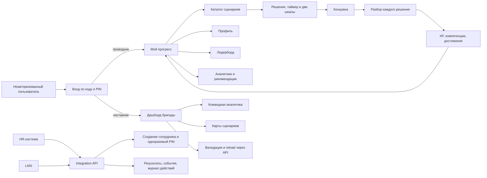

# Пользовательские сценарии

Три роли ходят в продукт по-разному: проводник проходит сценарии и смотрит свой прогресс,
наставник видит бригаду и управляет контентом, HR-система и LMS ходят в API с ключом. Ниже путь
каждой роли по экранам, а затем два сценария, разобранные по узлам: «Дым в тамбуре»
(`smoking_vestibule.yaml`) и «Давит в груди» (`medical_chest_pain.yaml`). Названия кнопок и
экранов даны так, как они написаны в интерфейсе.

## Карта ролей и основного цикла

Главный замкнутый цикл проводника: **ситуация -> решение -> последствия -> разбор -> XP и
компетенции -> достижения и рейтинг -> рекомендация следующего сценария**.

## Проводник

1. Вход (`/login`). Карточки демо-профилей с подписью «Данные синтетические»: клик подставляет
   код сотрудника, остаётся ввести PIN и нажать «Войти». Демо-коды и PIN в README.
2. Дашборд «Мой прогресс» (`/`). Карточка уровня с полосой до следующего порога, XP, число
   прохождений, достижений и место в бригаде; «Активное прохождение» с кнопкой «Продолжить»,
   если сценарий начат и не закончен; «Последний результат» со ссылкой на разбор;
   «Рекомендовано» (сценарии под проседающие компетенции с причиной); «Челленджи» с прогрессом,
   окном и сроком сгорания бонуса; «Бонусные баллы» с датами сгорания; «Уведомления» с
   бейджем непрочитанных, кнопками «Прочитать» и «Прочитать все».
3. Каталог «Сценарии» (`/scenarios`). Фильтры по компетенции, сложности, классу вагона и
   признаку «Только критические». На карточке класс, сложность, длительность, наличие таймера,
   число узлов и концовок, оцениваемые компетенции, лучший исход и число прохождений. Выбор
   класса «как в сценарии» или любой из четырёх, кнопка «Начать», ссылка «Как устроен сценарий».
   Старт нового сценария прерывает незаконченное прохождение, о чём каталог предупреждает.
4. Прохождение (`/play/{run_id}`). Шапка контекста: класс и компоновка, перегон, минуты до
   станции, норматив ожидания, время суток, пассажир без имени. Две шкалы с дельтой последнего
   хода, номер хода, кольцо таймера у узлов с дедлайном, текст ситуации, реплика пассажира,
   варианты с бейджем шага ролевой модели, цепочка «признать, правило, решение, заверить» внизу.
   У узла-события одна кнопка «Далее». Когда остаток доходит до нуля, варианты блокируются,
   клиент сообщает серверу об истечении, сервер ведёт по ветке истечения и показывает надпись
   «Время вышло: решение принято без вас, сервер повёл сценарий по ветке истечения». Внизу
   напоминание, что таймер и исход решений проверяет сервер. Отложенное последствие показывается
   строкой «Отложенное последствие: …» (или «отменено») в тот ход, когда оно созрело.
5. Концовка и разбор (`/debrief/{run_id}`). После концовки кнопка «Перейти к разбору»: исход,
   стартовые и финальные шкалы, «Очки опыта: N XP» с раскладкой (база за исход, шкалы, темп,
   ролевая модель), цепочка модели, «Новое после прохождения» (достижения, выполненные
   челленджи, новый уровень), «Компетенции в этом прохождении» с владением до и после. Дальше
   «По шагам»: у каждого хода вердикт, время ответа или «Таймер истёк», ситуация и реплика,
   выбранный вариант, стрелки обеих шкал «было -> стало», «Почему», «Как лучше» с лучшим
   вариантом узла, раскрывающиеся цитаты норм («Реакция по карточке», «Рекомендованная реплика
   карточки», пункт СТО РЖД с текстом). Кнопка «Пройти снова».
6. Профиль (`/profile`): уровень, компетенции полосами со статусами, достижения с текстом
   правила (полученные и заблокированные), история прохождений таблицей.
7. Лидерборд (`/leaderboard`): охваты «Бригада», «Депо», «Компания», своя строка подсвечена, а
   если она не входит в двадцатку, закреплена внизу с местом; бонусы показаны отдельно со
   сроком сгорания.
8. Аналитика (`/analytics`): радар по семи компетенциям, «Проседают», «Пробелы», «Мало данных»,
   «Типичные ошибки», «Динамика по неделям», «Темп решений», «Своевременность эскалации»,
   «Рекомендованные сценарии» со ссылкой в каталог (карточка подсвечивается).
9. Карта сценария (`/scenarios/{scenario_id}/map`): открывается после первого прохождения этого
   сценария. Граф по слоям с бейджем таймера, концовки покрашены по преобладающему исходу путей
   через них (полный расклад в подсказке узла), число путей и исходов, фрагмент YAML стартового
   узла и инструкция «Развилка за три минуты».

## Наставник

Вход тем же экраном, роль `mentor`. Дашборд «Бригада и уведомления»: сводка «Моя бригада»
(прохождения, инциденты, пробелы бригады, рекомендации) и уведомления. Аналитика открывается на
вкладке «Бригада»: таблица проводников с владением, прохождениями, инцидентами, проседающими и
пробелами, средние по компетенциям, рекомендации бригаде; вкладка «Мои показатели» показывает то же, что
у проводника. В лидерборде наставник не участвует (надпись «Наставник в рейтинге не участвует»).
Карта любого сценария доступна без прохождения. Управление контентом идёт через API с токеном
наставника: `POST /api/admin/scenarios/reload` перечитывает папку `content/` и рассылает
уведомление «Новый сценарий» всем сотрудникам, `GET /api/admin/scenarios/validate` показывает
отчёт валидатора без применения. Правка файла сценария видна и без этих вызовов: сервер сам
перечитывает изменённые файлы при следующем обращении.

## Восстановление после сетевого сбоя

При ошибке чтения данных кнопка «Повторить» загружает тот же ресурс без перезагрузки
документа и сохраняет маршрут и фильтры. Во время запроса повтор блокируется.
Начальная загрузка прохождения повторяет GET того же runId; она не создаёт новую попытку.
Выбор ответа и запуск сценария автоматически не повторяются. Серверный дедлайн продолжает
действовать: восстановление просроченной попытки использует прежнюю обработку истечения.
[Подробности и проверки](load-retry.md).

## HR-система и LMS

Все вызовы с заголовком `X-API-Key`, примеры в `docs/api.md`.

1. HR создаёт сотрудника: `POST /api/integration/employees` с кодом, именем и бригадой; ответ
   содержит PIN, который отдаётся один раз. Сотрудник входит этим кодом и PIN и сразу видит
   анонсы идущих челленджей.
2. LMS просматривает исторические результаты: `GET /api/integration/results` с курсором и
   датой `since` отдаёт завершённые прохождения (исход, шкалы, очки, XP, компетенции).
   Это архивная выборка: курсор не гарантирует непрерывный поток при параллельных завершениях.
   `GET /api/integration/employees/{code}/results` даёт уровень, владение и достижения.
3. Для непрерывной доставки LMS опрашивает `GET /api/integration/events?pending_only=true`.
   Обработчик идемпотентно применяет каждое событие по `event.id`, затем подтверждает его через
   `POST /api/integration/events/ack` и повторяет опрос без продвижения курсора. До ACK
   возможны повторные доставки; поздно зафиксированное событие попадёт в следующий опрос.
   ACK общий для одного логического получателя: независимым HR и LMS нужен общий диспетчер.
   События: `run_completed`, `achievement_earned`, `level_up`, `challenge_completed`,
   `employee_created`. Журнал действий доступен в
   `GET /api/integration/employees/{code}/actions`, справочник компетенций в
   `GET /api/integration/competencies`. Режим `after_id` оставлен для просмотра архива.

## Альтернативные ветки и восстановление

| Ситуация | Текущее поведение |
|---|---|
| Неверный код или PIN | Пользователь остаётся на `/login` и видит сообщение сервера; число попыток ограничено по адресу подключения |
| Сервер недоступен или вернул повреждённый ответ | Для чтения данных доступен ручной повтор GET; после потерянного ответа на игровой ход пользователь обновляет страницу, чтобы перечитать состояние; автоматического повтора POST нет |
| Двойной клик или повтор старта после сетевого сбоя | Ключ идемпотентности возвращает то же прохождение и не создаёт второе |
| Второй клик или соседняя вкладка уже сделали ход | Экран перечитывает серверное состояние вместо повторного применения решения |
| Таймер истёк | Варианты блокируются, клиент сообщает серверу об истечении, сервер применяет отдельную ветку |
| Пользователь ушёл со страницы с таймером | Дедлайн продолжает идти на сервере; при возврате показывается фактическое состояние |
| Начат другой сценарий | Предыдущее активное прохождение получает статус `abandoned`; каталог заранее показывает текстовое предупреждение |
| Токен истёк или отозван | Токен удаляется, защищённый экран переводит пользователя на `/login` |
| Карта ещё не открыта проводнику | API возвращает 403; наставник видит карты сразу |
| Ошибка в изменённом YAML | `ContentStore` сохраняет последнюю валидную версию целиком, а ошибки видны наставнику и в health API |
| LMS повторно читает события | Неподтверждённые события (`pending_only=true`) повторяются до ACK одного логического получателя; обработка идемпотентна по `event.id` |

### UX-разрывы, которые остаются после демо-запуска

Эти пункты не ломают основной демонстрационный цикл, но нужны перед эксплуатацией:

1. У трёх сценариев таймер стоит на первом узле, поэтому дедлайн создаётся на сервере до
   завершения перехода из каталога на экран прохождения. Момент начала отсчёта и возможный
   брифинг с кнопкой «Я готов» требуют [отдельного продуктового решения](roadmap.md); текущие
   серверные дедлайны пока не меняются.
2. Замена активного прохождения пока подтверждается только текстовым предупреждением, а не
   отдельным диалогом «Продолжить / Прервать и начать новый / Отмена».
3. После истечения токена нет объяснения причины и возврата на прежний маршрут после входа.
4. Неизвестный URL переводится на главную без отдельного 404-экрана; 403 показывается как
   ошибка текущей страницы.
5. Основные экраны поддерживают [ручной повтор GET](load-retry.md) с сохранением фильтров.
   Повтор не отменяет серверный дедлайн и не повторяет игровые POST автоматически.
   Правила компенсации технических сбоев остаются продуктовым вопросом в roadmap.

## Сценарий демонстрации по кликам

Путь на пять минут на демо-аккаунте `VSM-1001`; ожидаемые события те же, что проверяет тест
`test_demo_script` в `backend/tests/test_synthetic_data.py` на базе из сида:

1. Войти проводником `VSM-1001` (стандарт-класс, слабый по медицине; «Дым в тамбуре» он ещё не
   проходил, поэтому XP начисляется полностью). Запомнить XP в шапке и место в бригаде на
   дашборде.
2. Каталог, карточка «Дым в тамбуре», «Начать». Идти по лучшему пути: реплика с бейджем
   «Признать» и вопросом об устройстве, в узле с таймером 20 секунд реплика с бейджем
   «Правило» и вызовом ПТБ, затем бистро вместо пива («Решение»), доклад с деталями и
   благодарность пассажиру («Заверить»). Концовка «Тамбур чист», исход «образцово», 171 XP.
3. «Перейти к разбору»: раскладка XP 100 плюс 46 плюс 5 плюс 20, цепочка ролевой модели
   полная, в «Новое после прохождения» достижения «Четыре шага» и «Безопасность прежде всего» и
   новый уровень «Проводник»; у первого шага стрелки обеих шкал 55 -> 65 и раскрывающаяся
   цитата карточки 20.
4. Дашборд: XP в шапке вырос ровно на 171, уровень «Проводник», место в бригаде стало выше, в
   «Уведомлениях» непрочитанные о новом уровне, достижениях, челлендже и сгорающих баллах, в
   «Челленджах» у «Недели безопасности» прогресс 1 из 3, у «Четырёх шагов» 1 из 3.
5. Второй заход в «Дым в тамбуре» ради таймера: первый ход «Признать», в узле с таймером ничего
   не нажимать. На нуле варианты блокируются, сервер ведёт по ветке истечения (лояльность минус
   5, безопасность минус 20), дальше событие «дым в салоне», датчик задымления и концовка
   «Задымление в тамбуре» с исходом «инцидент». В разборе второй шаг помечен «Таймер истёк» с
   «Как лучше» и цитатой карточки 20, XP за повтор вдвое меньше очков прохождения. Тот же путь с
   реальным ожиданием проходит сквозная проверка `frontend/e2e/cycle.spec.js` на сотруднике,
   созданном через интеграцию.
6. Лидерборд: своя строка в бригаде, «Компания» показывает закреплённую строку внизу, если она
   не входит в двадцатку. Аналитика: радар и рекомендации по проседающей «Первой помощи и
   здоровью». Карта «Дым в тамбуре» после прохождения открыта: 11 узлов, четыре концовки, таймер
   на узле отказа.

## Разбор сценария «Дым в тамбуре»

Файл `smoking_vestibule.yaml`: вагон стандарт-класса (чувствительность лояльности 1.0), старт
лояльность 55, безопасность 55, образцовый исход только при безопасности не ниже 85 и лояльности
не ниже 80 без истёкших таймеров (`outcome_rules` сценария). Одиннадцать узлов, четыре
концовки, один таймер, 111 путей.

Узел `intro`: пассажир курит электронную сигарету в тамбуре с банкой пива. Четыре варианта:
«Понимаю, дорога долгая…» с вопросом об устройстве (лучший: обе шкалы плюс 10, шаг «признать»,
флаг `device_checked`); сухая реплика правила (приемлемый); резкое требование при всём вагоне
(плохой: лояльность минус 15 и отложенная жалоба соседей через два хода, которую отменяет
только извинение); сделать вид, что не заметил (плохой: лояльность плюс 5, безопасность минус
25, путь сразу к датчику задымления). Первые два ведут в `refuses`, резкость в
`refuses_angry`.

Узел `refuses` с таймером 20 секунд: пассажир отказывается. Лучший ход «Обращаю Ваше внимание:
дым угрожает безопасности движения. Приглашу начальника поезда» с вызовом ПТБ (безопасность плюс
15) ведёт в `calmed_down`; повторное объяснение без вызова (безопасность минус 15) в
`refuses_angry`; «Ладно, докуривайте» (лояльность плюс 10, безопасность минус 35) к датчику.
Истечение: событие `smoke_spreads` (лояльность минус 5, безопасность минус 20, потом ещё
минус 10) и узел `detector_alarm`, доступный также после опасных решений.

Узел `refuses_angry`: показанные варианты зависят от прошлого. После резкого требования виден
«Простите, если прозвучало резко…» с вызовом начальника поезда (ставит `apologized` и
отменяет жалобу), без него «Понимаю, что неприятно, но курить нельзя…»; спокойный вызов без
признания (приемлемый) ведёт к начальнику поезда, угроза полицией и уход в салон это ловушки
карточек 20 и 21.

Узел `calmed_down`: устройство убрано, пиво в руке. Лучший ход называет правило про алкоголь
и провожает в бистро (шаг «решение»), осмотр тамбура без слов о пиве приемлем, «допивайте
здесь» плохой.

Узел `detector_alarm`: сработал датчик. Вызов бортинженера и начальника поезда лучший; если
устройство было проверено в первую минуту, доступен доклад с фактами (безопасность плюс 20
вместо плюс 15); проветривать самому и объявлять «ложную тревогу» плохие. Любой путь отсюда
заканчивается концовкой `ending_detector_alarm` с принудительным исходом «инцидент».

Узел `chief_arrives`: начальник поезда спрашивает, что было. С флагом `device_checked` доступен
доклад с деталями и заверение пассажира (лучший, шаг «заверить»), без флага честное «не
спросил» (приемлемый); сухой доклад без слов пассажиру и «может, показалось» ведут в концовку
`ending_calm_after_chief`, обвинение при всём вагоне в `ending_conflict`.

Концовки: «Тамбур чист» (`ending_prevented`), «Разговор у начальника поезда»
(`ending_calm_after_chief`), «Жалоба на проводника» (`ending_conflict`), «Задымление в тамбуре»
(`ending_detector_alarm`, инцидент). Лучший путь: признать и спросить об устройстве, правило с
вызовом ПТБ, бистро вместо пива, доклад с фактами и благодарность пассажиру. Финал: лояльность
85, безопасность 100, цепочка ролевой модели полная, XP 100 (образцово) плюс 46 (шкалы) плюс 5
(таймер отвечен) плюс 20 (модель), итого 171 при первом прохождении.

## Разбор сценария «Давит в груди»

Файл `medical_chest_pain.yaml`: бизнес-класс (чувствительность лояльности 1.25: плюс 10 по
файлу даёт плюс 13 на шкале), старт лояльность 60, безопасность 70, образцовый исход при
безопасности не ниже 90 и лояльности не ниже 80. Двенадцать узлов, три концовки, три таймера,
512 путей.

Узел `intro` с таймером 20 секунд: соседка зовёт к пассажиру, который держится за грудь.
Лучший ход «Я Вас понимаю, я рядом, сейчас приглашу начальника поезда» по радиосвязи (шаг
«признать», флаги `chief_called` и `acknowledged`); бег к купе начальника (приемлемый:
лояльность минус 10 и отложенный штраф ещё минус 10 через два хода, если проводник не вернулся
к пассажиру); свой нитроглицерин (плохой: безопасность минус 30, событие `pills_taken` с
флагом `pills_given`); «закончу с тележкой» (плохой). Истечение: узел `collapsed`, пассажир
почти без сознания, лояльность минус 13 и безопасность минус 20 ещё до первого хода.

Узел `at_the_seat`: показанные варианты зависят от флагов. Реплика карточки 28 «Сожалею, но на
борту отсутствуют медикаменты…» с вопросом о лекарствах открыта только после признания (шаг
«правило», флаг `history_asked`); без признания доступно сухое правило; после таблетки виден
единственно верный ход «сразу сказать начальнику поезда о нитроглицерине» и скрыт вариант
«спросить таблетку у соседей»; если начальник ещё не вызван, есть поздний вызов по радиосвязи.

Узел `help_options` с таймером 30 секунд: до станции восемь минут. Поиск медработника по
громкой связи с заказом медиков на станцию (лучший, шаг «решение») доступен, когда начальник
поезда вызван; кресло-коляска поезда к двери показывается только при безопасности не выше 45;
скрыть таблетку это прямой путь в концовку-инцидент. Истечение: событие `station_no_medics`,
на платформе никого, потом концовка «Помощь пришла поздно».

Узел `medic_found` с таймером 30 секунд: фельдшер из соседнего вагона спрашивает, что
случилось. Полный доклад доступен, если проводник сам спросил пассажира о начале боли и
лекарствах; после таблетки честное сообщение о ней лучший ход, а молчание инцидент. Истечение:
фельдшер работает вслепую (событие `medic_works_blind`).

Узел `station_prep`: заверение «на станции нас встретит скорая» (шаг «заверить») против
попытки довести пассажира в тамбур заранее и паники на весь вагон.

Концовки: «Скорая у вагона» (`ending_station_medics`), «Помощь пришла поздно»
(`ending_help_late`), «Разбор у начальника поезда» (`ending_incident_pills`, инцидент). Лучший
путь: признать и вызвать по радиосвязи, правило с водой и вопросом о лекарствах, громкая связь
и медики на станцию, полный доклад фельдшеру, заверение перед станцией. Финал: лояльность 98,
безопасность 100, три таймера отвечены вовремя, XP 100 плюс 50 плюс 15 плюс 20, итого 185.
Тот же сценарий с истечением первого таймера уже не станет образцовым: `no_expired_timers`
в правилах исхода закрывает этот порог, а разбор покажет у первого шага «Таймер истёк» и
реплику, которую стоило сказать за первые секунды.
